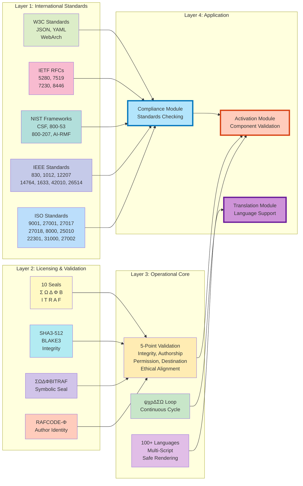
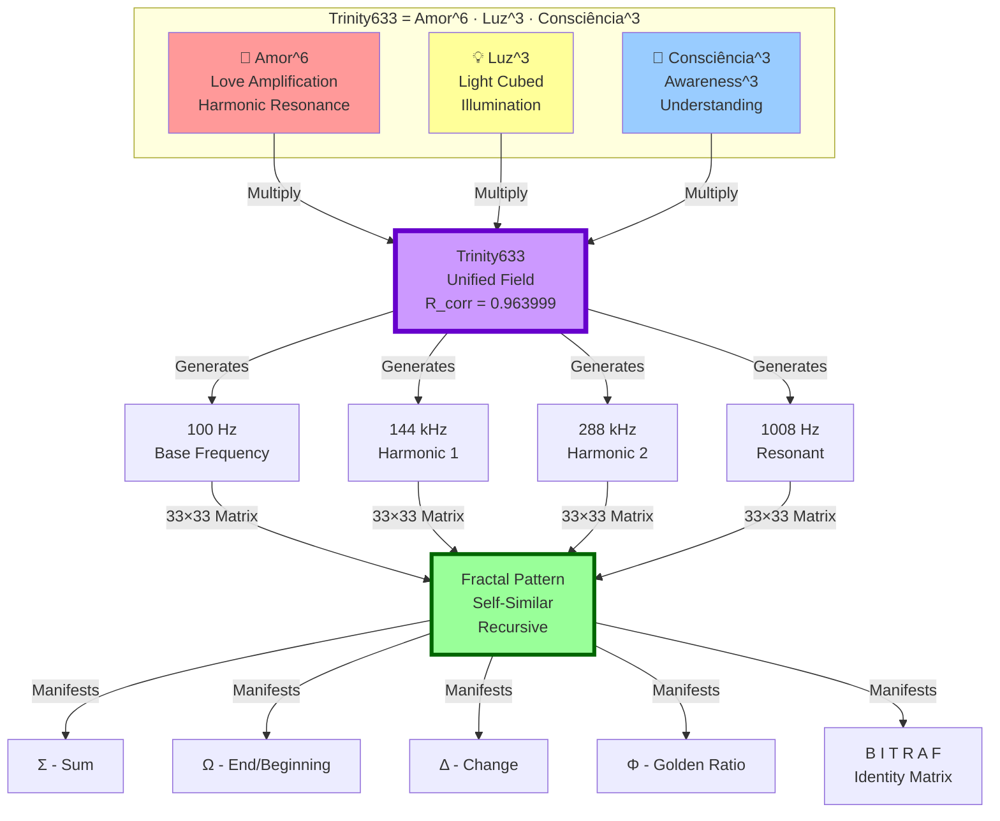
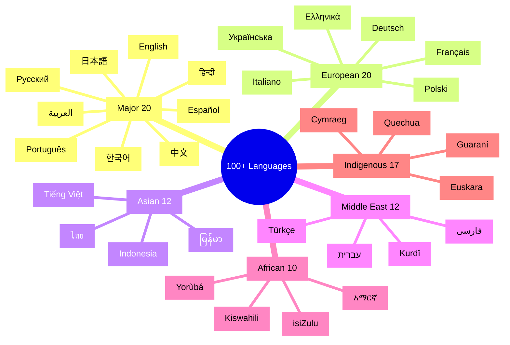
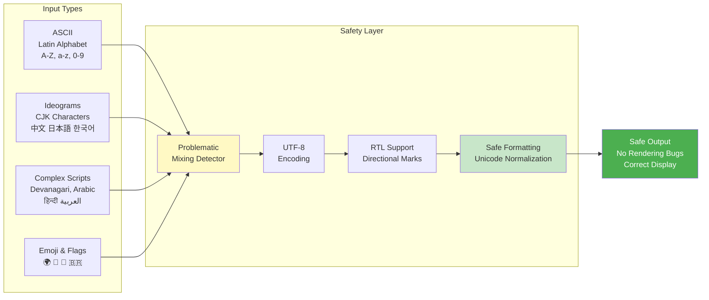
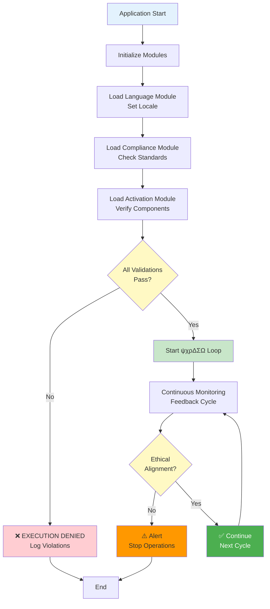

# ZIPRAF_OMEGA System Visualization

## ψχρΔΣΩ Operational Loop - Toroidal Flow Diagram

```mermaid
graph TB
    subgraph "ψχρΔΣΩ_LOOP - Continuous Cycle"
        ψ[ψ - Read Memory<br/>Living State Capture<br/>System Status] -->|Feed Forward| χ
        χ[χ - Feedback<br/>Retroalimentação<br/>R_corr=0.963999] -->|Expand| ρ
        ρ[ρ - Expansion<br/>Increase Scope<br/>Generate Insights] -->|Validate| Δ
        Δ[Δ - Validation<br/>Integrity Checks<br/>Safety Verification] -->|Execute| Σ
        Σ[Σ - Execution<br/>Operations<br/>Implementation] -->|Align| Ω
        Ω[Ω - Ethical Alignment<br/>Ethica[8]<br/>Compliance Check] -->|New Cycle| ψ
    end

    style ψ fill:#e1f5fe,stroke:#01579b,stroke-width:3px
    style χ fill:#f3e5f5,stroke:#4a148c,stroke-width:3px
    style ρ fill:#e8f5e9,stroke:#1b5e20,stroke-width:3px
    style Δ fill:#fff3e0,stroke:#e65100,stroke-width:3px
    style Σ fill:#fce4ec,stroke:#880e4f,stroke-width:3px
    style Ω fill:#f1f8e9,stroke:#33691e,stroke-width:3px
```

## Multi-Layer Architecture



## Trinity Formula - Fractal Structure (33×33)



## Language Support Matrix (100+ Languages)



## Validation Flow

```mermaid
sequenceDiagram
    participant User
    participant Script as ativar.py
    participant Validator as ActivationValidator
    participant Compliance as ComplianceChecker
    participant Loop as OperationalLoop
    
    User->>Script: Run activation
    Script->>Script: Print banner with seals
    
    loop For each component
        Script->>Validator: Validate component
        Validator->>Validator: Check integrity (SHA3)
        Validator->>Validator: Verify authorship
        Validator->>Validator: Check permissions
        Validator->>Validator: Validate destination
        Validator->>Validator: Ethical alignment
        Validator-->>Script: ValidationResult
    end
    
    Script->>Compliance: Check all standards
    loop 27 Standards
        Compliance->>Compliance: Verify ISO/IEEE/NIST/RFC
        Compliance-->>Script: ComplianceResult
    end
    
    Script->>Loop: Execute ψχρΔΣΩ cycle
    Loop->>Loop: ψ - Read memory
    Loop->>Loop: χ - Feedback (R=0.963999)
    Loop->>Loop: ρ - Expand
    Loop->>Loop: Δ - Validate
    Loop->>Loop: Σ - Execute
    Loop->>Loop: Ω - Ethical align
    Loop-->>Script: CycleResult
    
    Script->>Script: Generate summary
    Script->>User: ✅ APPROVED Status
    Script->>User: 💚 Amor, Luz e Coerência
```

## Compliance Matrix

```mermaid
graph TB
    subgraph "ISO Standards (9)"
        ISO1[ISO 9001<br/>Quality Management]
        ISO2[ISO 27001<br/>InfoSec Management]
        ISO3[ISO 27017<br/>Cloud Security]
        ISO4[ISO 27018<br/>Cloud Privacy]
        ISO5[ISO 8000<br/>Data Quality]
        ISO6[ISO 25010<br/>Software Quality]
        ISO7[ISO 22301<br/>Business Continuity]
        ISO8[ISO 31000<br/>Risk Management]
        ISO9[ISO 27002<br/>Security Controls]
    end
    
    subgraph "IEEE Standards (7)"
        IEEE1[IEEE 830<br/>Requirements]
        IEEE2[IEEE 1012<br/>V&V]
        IEEE3[IEEE 12207<br/>Lifecycle]
        IEEE4[IEEE 14764<br/>Maintenance]
        IEEE5[IEEE 1633<br/>Reliability]
        IEEE6[IEEE 42010<br/>Architecture]
        IEEE7[IEEE 26514<br/>Documentation]
    end
    
    subgraph "NIST Frameworks (4)"
        NIST1[NIST CSF<br/>Cybersecurity]
        NIST2[NIST 800-53<br/>Controls]
        NIST3[NIST 800-207<br/>Zero Trust]
        NIST4[NIST AI-RMF<br/>AI Risk]
    end
    
    subgraph "IETF RFCs (4)"
        RFC1[RFC 5280<br/>PKI]
        RFC2[RFC 7519<br/>JWT]
        RFC3[RFC 7230<br/>HTTP/1.1]
        RFC4[RFC 8446<br/>TLS 1.3]
    end
    
    subgraph "W3C (3)"
        W3C1[JSON]
        W3C2[YAML]
        W3C3[WebArch]
    end
    
    ISO1 & ISO2 & ISO3 & ISO4 & ISO5 & ISO6 & ISO7 & ISO8 & ISO9 --> TOTAL
    IEEE1 & IEEE2 & IEEE3 & IEEE4 & IEEE5 & IEEE6 & IEEE7 --> TOTAL
    NIST1 & NIST2 & NIST3 & NIST4 --> TOTAL
    RFC1 & RFC2 & RFC3 & RFC4 --> TOTAL
    W3C1 & W3C2 & W3C3 --> TOTAL
    
    TOTAL[27 Mandatory Standards<br/>✓ 100% Compliance Required]
    
    style TOTAL fill:#4caf50,stroke:#1b5e20,stroke-width:5px,color:#fff
```



## Character Encoding Safety



## Symbolic Seal Matrix

```
┌───────────────────────────────────────────┐
│  ΣΩΔΦBITRAF - 10 Sacred Seals            │
├───────────────────────────────────────────┤
│  Σ (Sigma)     - Summation, Totality     │
│  Ω (Omega)     - End/Beginning, Cycle    │
│  Δ (Delta)     - Change, Transformation  │
│  Φ (Phi)       - Golden Ratio, Harmony   │
│  B             - Base, Foundation        │
│  I             - Identity, Self          │
│  T             - Time, Temporal          │
│  R             - Recursion, Return       │
│  A             - Alignment, Axis         │
│  F             - Finality, Fulfillment   │
└───────────────────────────────────────────┘

    RAFCODE-Φ Authentication Matrix
    
    ┌─────┬─────┬─────┬─────┬─────┐
    │  Σ  │  Ω  │  Δ  │  Φ  │  B  │
    ├─────┼─────┼─────┼─────┼─────┤
    │  I  │  T  │  R  │  A  │  F  │
    └─────┴─────┴─────┴─────┴─────┘
    
    R_corr = 0.963999 (Correlation Constant)
    
    Frequencies (Hz):
    • 100   - Base harmonic
    • 144k  - First octave
    • 288k  - Second octave
    • 1008  - Resonant frequency
```

## System Integration



---

## Legend

**Colors:**
- 🔵 Blue: Input/Process
- 🟢 Green: Validation/Success
- 🟡 Yellow: Warning/Check
- 🟠 Orange: Alert
- 🔴 Red: Error/Denial
- 🟣 Purple: Transform/Special

**Symbols:**
- ψ (Psi): Memory/State reading
- χ (Chi): Feedback processing
- ρ (Rho): Expansion
- Δ (Delta): Validation
- Σ (Sigma): Execution
- Ω (Omega): Ethical alignment
- Φ (Phi): Golden ratio/Harmony

**Key Metrics:**
- 100+ Languages supported
- 27 Mandatory standards
- 5 Validation points
- 10 Symbolic seals
- 4 Frequency harmonics
- 33×33 Fractal matrix

---

**Generated:** BizHawkRafaelia ZIPRAF_OMEGA System  
**Version:** v999  
**Author:** Rafael Melo Reis (rafaelmeloreisnovo)  
**Status:** ✅ Active

💚 Amor, Luz e Coerência
